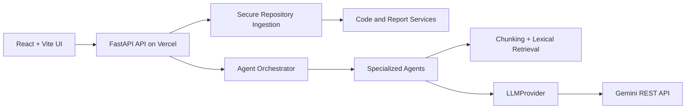
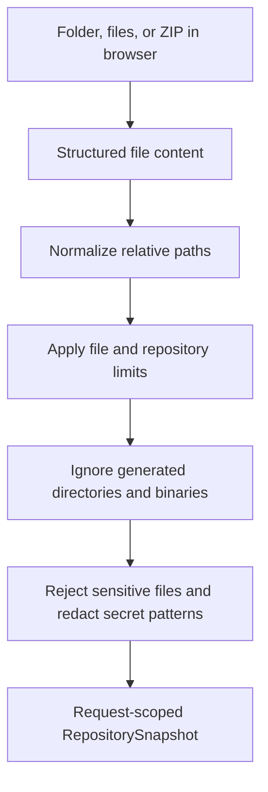
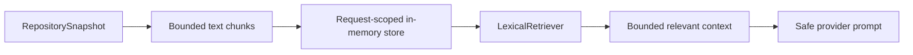
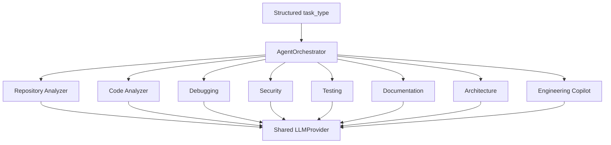

# Architecture

ForgeAI keeps repository analysis request-scoped so the same application can run locally or as a Vercel Python function. The browser supplies a structured snapshot; the backend validates and redacts it before deterministic analysis or LLM retrieval.

## System Architecture

## Repository Ingestion

The backend never executes uploaded content. The browser supports folders/files and ZIP extraction with `fflate`; the API receives only structured file content. Direct object storage uploads can be added later for larger projects.

## RAG Pipeline

The MVP deliberately does not claim persistent indexing, embeddings, or a vector database. `DocumentChunk`, `RepositoryIndexer`, `EmbeddingProvider`, `VectorStore`, and `Retriever` remain extension boundaries.

## Agent Orchestration

Deterministic endpoints use local analyzers directly; generative tasks use the same provider abstraction and receive retrieved, redacted context. This avoids eight separate model implementations.

## Deployment Decision

Vercel serves the compiled frontend from `frontend/dist` and routes `/api/*` to `api/index.py`, which imports the existing FastAPI application. The API does not rely on a permanent process or global repository state. `vercel.json` intentionally uses current build/output/rewrites fields rather than the legacy `builds` configuration.
