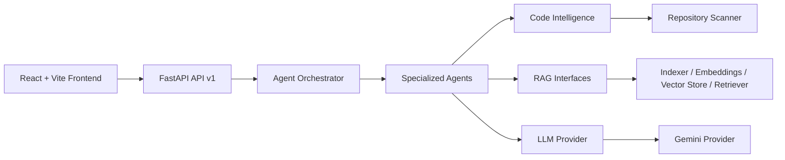

# Architecture

Phase 1 establishes boundaries between the user interface, API, orchestration, specialist agents, code intelligence, retrieval, and model providers. Only the health route is exposed as a working product capability. The remaining components are contracts for later implementation.

## Boundaries

- `frontend/src/api` owns HTTP calls and graceful connection handling.
- `backend/app/api` owns versioned HTTP routes and response schemas.
- `backend/app/core` owns configuration, logging, and centralized error behavior.
- `backend/app/agents` owns agent contracts and future request routing.
- `backend/app/services` owns provider abstractions such as `LLMProvider`.
- `backend/app/rag` owns document, embedding, storage, and retrieval contracts.
- `backend/app/code_intelligence` owns repository scanning and AST analysis contracts.
